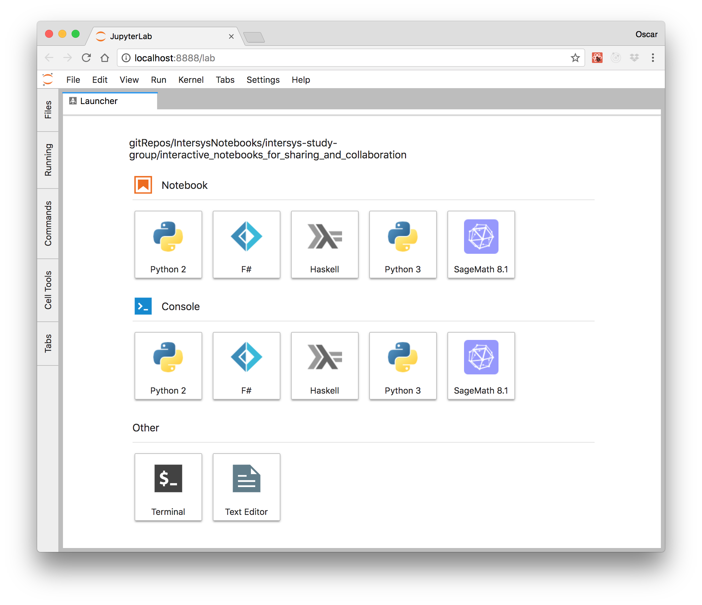

### Installing `jupyterlab`

Follow instructions from [the official `jupyterlab` github repository](https://github.com/jupyterlab/jupyterlab). Please take a look at the `README.md` file for complete and updated instructions.

#### Using `conda` command line tool, or the *Anaconda Navigator* GUI.

Once you have installed Anaconda for your OS, you may install `jupyterlab`  At the moment of writing this, you can do it with: 

```
$ conda install -c conda-forge jupyterlab
```

If you prefer to use a GUI, learn how to use the Anaconda Navigator, in order to install jupyterlab.

#### Using your environment installed `pip`

Hopefully you are working inside an isolated environment. That being said, if you prefer to use `pip`:

```
pip install jupyterlab
```

This should also work across different OS (Windows, Linux and Mac OS X).

### Verify you can use `jupyterlab` from your browser

You can run `jupyterlab` from a command line (once it is in your `PATH` environment variable). You should be able to launch it from Anaconda Navigator too.


Depending on the kernels you have installed in your machine, you should be able to see something similar to the following:

